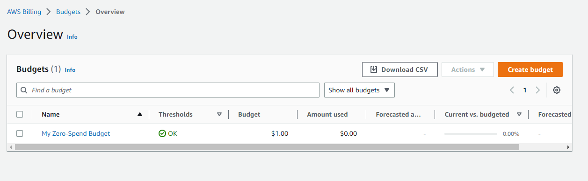

# Week 0 — Billing and Architecture

##Created Budget
Create zero spend budget.  I want to be alerted of spend so I don't go over or in case I forgot to stop a service

##Recreate Logical Architectual Diagram in Lucid Charts
I recreated the logical architectual Diagram using Lucid. 

##Napkin recreation of Logical Architectual Diagram
I sketched a logical architectual diagram on a piece of paper because I did not have a napkin

