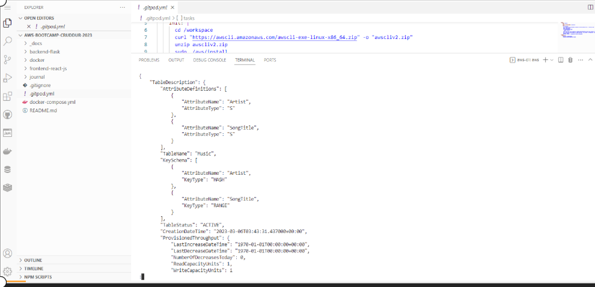

# Week 1 — App Containerization

##Connected to frontend of applications
##I was able to connect the frontend

##Connected to backend of applications
##I was able to connect the backend

##Connected to Notification and displayed edits made
##Connected to the Notifications and make changes that appeared on frontend

##Connected to Dynamodb 
##Connected to the Dynamodb

##Connected to Postgres 
##Connected to the Postgres

