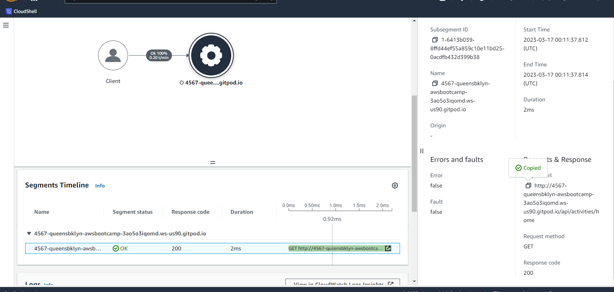
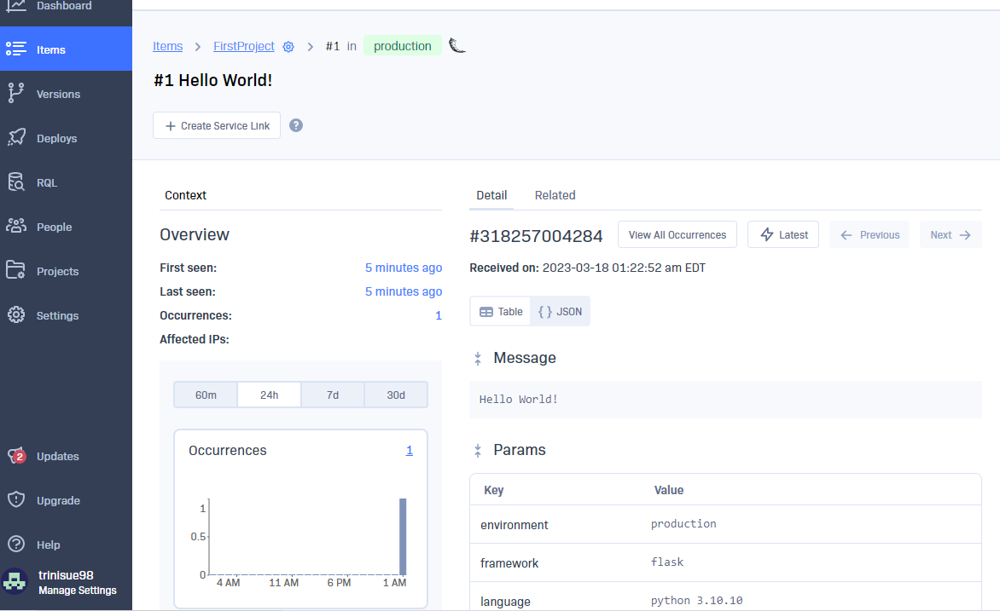

# Week 2 — Distributed Tracing

## Connected to Honeycomb 
##I was able to connect Honeycomb and get data

## Connected to X-RAY and was able to see data 

# Connected to Rollbar and was able to see data 

# Connected to Sampling rule created and showing in AWS

